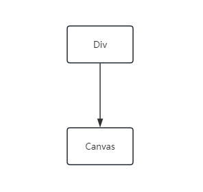
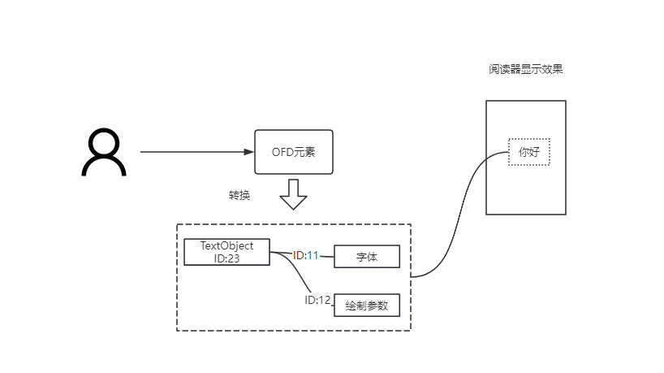

# OFDRW 扩展 自定义元素

OFDRW提供了一种扩展机制，允许用户自定义元素，以满足用户对OFD文档生成的更高级别的需求。

目前OFDRW主要提供了两种方式来扩展自定义元素：

- **基于Canvas的扩展**：适合生成较为复杂OFD文档效果或需要重复频繁复用的场景，需要掌握Canvas的绘制API。 ***推荐***
- **基于Div的扩展**：适合于对文档结构有较高定制要求的场景，需要对OFDRW元素的生成过程有更深入的控制。

若你需要使用OFDRW深入控制OFD文档的生成过程，你可能还需了解一些OFDRW布局和元素的概念，详见后续章节 **3.OFDRW元素概论** 。

## 1.基于Canvas的扩展

**基于Canvas的扩展是一种较为简单，也是较为推荐扩展实现方式。**

Canvas是Div一种特殊的扩展，Canvas集成了Div的所有功能，提供了图形化的绘制接口（ctx），该方式下调用者不必关心OFD图元以及资源管理，通过控制Canvas的绘制接口（ctx）来实现绘制效果。




扩展方式如下：

1. 创建自定义元素，继承`CanvasBase`类。
2. 重写Canvas的构造器。
3. 实现`Drawer#draw`方法。
4. 在`Drawer#draw`方法中通过`ctx`对象绘制图形。

```java
// 1. 创建自定义元素Line，继承CanvasBase类
public class Line extends CanvasBase {
    private double[] beginPoint = new double[]{0, 0};
    private double[] endPoint = new double[]{0, 0};

    // 2. 重写Canvas的构造器
    public Line(double x, double y, double w, double h, double[] beginPoint, double[] endPoint) {
        super(x, y, w, h);
        this.beginPoint = beginPoint;
        this.endPoint = endPoint;
    }
    public Line(double w, double h, double[] beginPoint, double[] endPoint) {
        super(w, h);
        this.beginPoint = beginPoint;
        this.endPoint = endPoint;
    }

    // 3. 实现Drawer#draw方法
    public void draw(DrawContext ctx) throws IOException {
        // 4. 在Drawer#draw方法中通过ctx对象绘制图形
        ctx.save();
        try {
            ctx.setLineWidth(0.353d);
            ctx.beginPath();
            ctx.strokeStyle = "#000000";
            ctx.moveTo(beginPoint[0], beginPoint[1]);
            ctx.lineTo(endPoint[0], endPoint[1]);
            ctx.stroke();
        } finally {
            ctx.restore();
        }
    }
}
```

- 完整代码详见：[Line.java](../../src/main/java/org/ofdrw/layout/element/canvas/Line.java)


基于Canvas的扩展方式也有一些问题:

- Canvas是一种特殊不可分割的Div元素，在流式布局中空间不足将被移动到下一页中，若Canvas大于页面大小将无法添加到页面中。
- Canvas是一种较为高级的扩展，您无法操作OFD图元、操作OFD虚拟容器进行资源的管理。


## 2.基于Div的扩展

**基于Div的扩展是一种较为高级的扩展方式也较为复杂。**

在详细讲解如何扩展之前，您可以需要了解OFDRW布局和OFDRW元素的基本原理，详见后续章节 **3.OFDRW元素概论** 。

基于Div的扩展方式，您可以完全控制OFDRW元素转换为OFD图元的过程，并支持操作OFD虚拟容器，进行资源的管理等高级功能。

由于OFDRW具有流式布局和固定布局，在流式布局中：
- 若您的元素大小由内容决定，您需要重写提供内容最终生成大小的计算方法。
- 若您的元素可以在流式布局时空间不足时是否可以分割为多个元素，还需指定元素是否可分割，并提供分割方法。


扩展方式如下：

1. 创建自定义元素，继承`Div`类，Div为MVC中的模型层，在这里主要存储一些数据和配置参数，不做具体图元生成逻辑的控制。
2. 元素大小是否内容动态决定：
   - 固定大小，需要提供构造器设置元素大小。
   - 动态大小，需要重写`Div#doPrepare`方法，用于提供在指定宽度下元素的最终大小。
3. 在构造器中设置元素是否可被分割：
   - 不分割：在构造器设置元素属性为不可分割。
   - 可分割：重写`Div#split`方法，用于在流式布局时将元素分割为多个元素，您可能还需重写`clone`完成分割时的复制。
4. 重写`Div#elementType`方法，用于返回元素的类型供解析引擎识别选择对应的渲染器。
5. 创建自定义元素的渲染器，实现`Processor`，渲染器为MVC中的控制器层，用于将您的自定义元素转换为OFD图元，在`render`方法中您可以通过资源管理获取到文档的虚拟容器进行深度的操作。
6. 在虚拟页面解析引擎(VPageParseEngine)中注册您自定义元素的渲染器。

以Img对象为例，Img对象是OFDRW中的一个自定义元素，它继承自Div，用于表示OFD中的图片对象。

图片对象Img.java 如下：

```java
// 1. 创建自定义元素Img，继承Div类
public class Img extends Div {
    
    private Path src;
    
    // 2. 固定大小，提供构造器设置元素大小
    public Img(double width, double height, Path src) throws IOException {
        // 3. 在构造器中设置元素不可分割
        this.setIntegrity(true);
        this.src = src;
        this.setWidth(width);
        this.setHeight(height);
    }
    
    public Path getSrc() { return src; }
   
    // 4. 返回元素的类型供解析引擎识别选择对应的渲染器。
    @Override
    public String elementType() {
        return "Img";
    }
}
```

Img对象的渲染器 ImgRender.java 如下：

```java
// 5. 创建自定义元素的渲染器，实现Processor
public class ImgRender implements Processor {
   /**
    * 执行图片渲染
    *
    * @param pageLoc    页面在虚拟容器中绝对路径。
    * @param layer      图片将要放置的图层
    * @param resManager 资源管理器
    * @param div        图片对象
    * @param maxUnitID  最大元素ID提供器
    * @throws RenderException 渲染发生错误
    */
    @Override
    public void render(ST_Loc pageLoc, CT_PageBlock layer, ResManager resManager, Div div, AtomicInteger maxUnitID)throws RenderException {
        Img e = (Img) div;
        Path p = e.getSrc();
        // 资源管理
        ST_ID id = null;
        try {
           id = resManager.addImage(p);
        } catch (IOException ex) {
           throw new RenderException("渲染图片复制失败：" + ex.getMessage(), ex);
        }
        // 构造OFD图片图元
        ImageObject imgObj = new ImageObject(maxUnitID.incrementAndGet());
        imgObj.setResourceID(id.ref());
        double x = e.getX() + e.getMarginLeft() + e.getBorderLeft() + e.getPaddingLeft();
        double y = e.getY() + e.getMarginTop() + e.getBorderTop() + e.getPaddingTop();
        imgObj.setBoundary(x, y, e.getWidth(), e.getHeight());
        imgObj.setCTM(new ST_Array(e.getWidth(), 0, 0, e.getHeight(), 0, 0));
        // 将OFD 图片图元对象加入图层。
        layer.addPageBlock(imgObj);
    }
}

```

向虚拟页面解析引擎(VPageParseEngine)中注册您自定义元素的渲染器。

```java
class Main {
    public static void main(String[] args) {
        // 注册Img对象的渲染器
        VPageParseEngine.register("Img", new ImgRender());
        // ...
    }
}
```

完整代码详见：

- [Img.java](../../src/main/java/org/ofdrw/layout/element/Img.java)
- [ImgRender.java](../../src/main/java/org/ofdrw/layout/engine/render/ImgRender.java)

若您需要支持分割元素扩展示例，您可以参考：

- [Paragraph.java](../../src/main/java/org/ofdrw/layout/element/Paragraph.java)
- [ParagraphRender.java](../../src/main/java/org/ofdrw/layout/engine/render/ParagraphRender.java)

## 3.OFDRW元素概论


为了让OFD页面上显示文字图形等元素，必须使用OFD中的对象描述这些图形图像，这些对象被称作图元（CT_GraphicUnit）常见的图元有：`TextObject`、`PathObject`、`ImageObject`等。


OFDRW元素是对OFD对象生成方法的封装，通过OFDRW元素可以简化OFD图元的创建过程，减少开发者对OFD对象的直接操作，
这样开发者便不需要关心OFD图元对象的ID、资源ID、虚拟容器等细节，更多关注于文档内容的生成。

通常一个OFDRW元素往往需要多个OFD图元来实现，从OFD文档本身来说OFDRW元素是一个高层次的抽象，而OFD图元是一个低层次的实现。



基于上述设计OFDRW设计时采用了 **模型-控制器-视图**(Model-Controller-View) 的设计模式，在OFDRW中它们分别代表：

- **模型**：OFDRW元素（**Div**），用于给用户提供API设置绘制效果的参数，包括Div元素以及由Div元素扩展的元素，例如Img、Canvas、Paragraph等元素。
- **控制器**：OFD图元生成器（**Render**），负责将OFDRW元素转换为OFD图元并处理对图元相关的资源管理（字体、图片、绘制参数等虚拟容器操作和资源管理），每个OFDRW元素都有一个对应的OFD图元生成器。
- **视图**：OFD对象（**CT_GraphicUnit**），即最终呈现可实效果的OFD中的图元对象，包括TextObject、PathObject、ImageObject等。


实际用户在操作OFDRW元素是可能还会接触到 虚拟页面、流式布局等概念，详见 [《OFD 布局设计文档》](../layout/README.md) 。

在OFDRW中，用户通过创建一个OFDRW元素，设置元素的属性，然后将元素添加到虚拟页面或文档中。
当文档关闭时，OFDRW会将虚拟页面中的OFDRW元素转换为OFD对象，也就是控制器驱动模型转换为视图的过程，该过程由 **虚拟页面解析引擎（VPageParseEngine）** 实现。

在虚拟页面解析引擎（VPageParseEngine）中，存储了每种OFDRW元素的 **Render** 对象，当 **VPageParseEngine** 得到一个OFDRW元素时，会根据元素的类型找到对应的 **Render** 对象，然后调用 **Render** 对象的 **render** 方法，将OFDRW元素转换为OFD对象。


任何OFDRW自定义元素都是基于Div扩展得到，因此任何OFDRW元素转换为图元前总是会先调用Div的 **Render** 对象的 **render** 方法，然后再调用自身的 **render** 方法。

